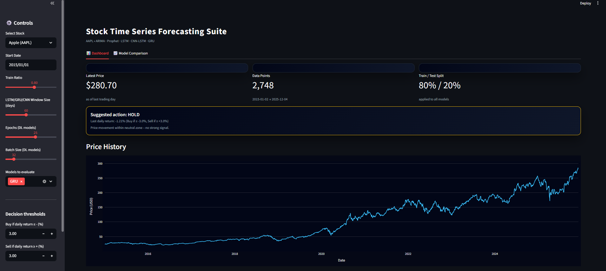
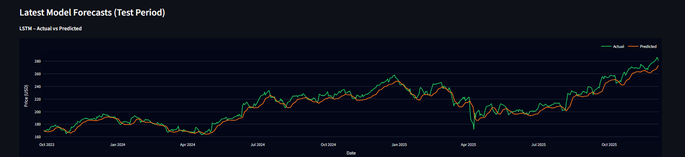
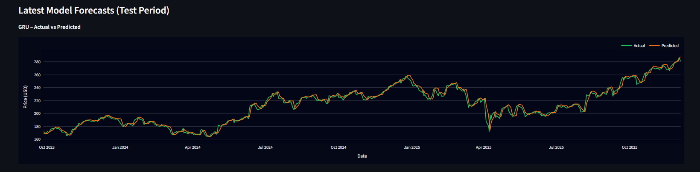

# 📈 Stock Price Forecasting
<p align="left">

  <!-- Python -->
  

  <!-- Streamlit -->
  

  <!-- Machine Learning -->
  

  <!-- Deep Learning -->
  

  <!-- Status -->
  

  <!-- License -->
  

</p>


### End-to-end Time Series Forecasting using Python, Machine Learning, Deep Learning & a real-time Streamlit Application.

---

## 📌 Project Overview

This project implements a complete stock market forecasting workflow — from **data extraction and exploratory analysis** to **model development and interactive deployment**.

It enables users to:

- Analyze historical stock price trends  
- Compare multiple forecasting models  
- Generate future price predictions  
- Visualize evaluation metrics  
- Use a Streamlit web app for real-time analysis  
- Receive automated email alerts when price thresholds are crossed  

This project replaces my earlier *Apple Stock Analysis* and serves as a full portfolio-grade time-series forecasting solution.

---

## 🎯 Problem Statement

Stock market prediction is challenging due to volatility and noise. Analysts need tools that allow them to:

- Explore price behavior  
- Apply multiple forecasting techniques  
- Evaluate and compare models  
- Predict future movements  
- Use an interactive dashboard  

This project provides all these capabilities in one unified workflow.

---

## 🧠 Modeling Approaches

### **Statistical Models**
- ARIMA  
- SARIMA  
- Prophet  

### **Deep Learning Models**
- LSTM (Single & Multi-layer)  
- GRU  
- CNN–LSTM Hybrid  

### **Baseline Models**
- Naïve Forecast  
- Moving Average  

Each model includes training, validation, forecasting, and visual evaluation.

---

## 📚 Notebooks Included

| Notebook | Description |
|---------|-------------|
| `01_data_eda.ipynb` | Exploratory Data Analysis |
| `02_arima_modelling.ipynb` | ARIMA model |
| `03_lstm_modelling.ipynb` | LSTM forecasting |
| `04_multistock_comparison.ipynb` | Multi-stock comparison |
| `05_prophet_model.ipynb` | Prophet model |
| `06_cnn_lstm_modelling.ipynb` | CNN-LSTM hybrid |
| `07_gru_modelling.ipynb` | GRU model |

---

## 🖥️ Streamlit Application

The application provides:

- Real-time stock data from Yahoo Finance  
- Interactive visualizations  
- Forecasting using ML/DL models  
- Email alerts  
- Clean, responsive UI  

### Run the app locally:

```
cd app
pip install -r requirements.txt
streamlit run app.py
```

📁 Folder Structure

```
stock-price-forecasting/
│
├── app/
│   ├── app.py
│   ├── email_alert.py
│   ├── requirements.txt
│   └── .gitignore
│
├── notebooks/
│   ├── 01_data_eda.ipynb
│   ├── 02_arima_modelling.ipynb
│   ├── 03_lstm_modelling.ipynb
│   ├── 04_multistock_comparison.ipynb
│   ├── 05_prophet_model.ipynb
│   ├── 06_cnn_lstm_modelling.ipynb
│   ├── 07_gru_modelling.ipynb
│
├── assets/      ← store images/screenshots here
│
└── README.md
```

## 📸 Screenshots
- Streamlit Homepage
  

- LSTM Prediction
  

- GRU Prediction
  

- Model Comparision
  

## 🔮 Future Enhancements

- Ensemble forecasting

- Sentiment-driven models

- Hyperparameter tuning (Optuna)

- Deployment on Streamlit Cloud / HuggingFace Spaces

- Docker containerization

## ✔️ Conclusion

This project showcases an end-to-end time-series forecasting pipeline using classical ML, deep learning architectures, and interactive deployment — making it a strong real-world Data Science portfolio project.
